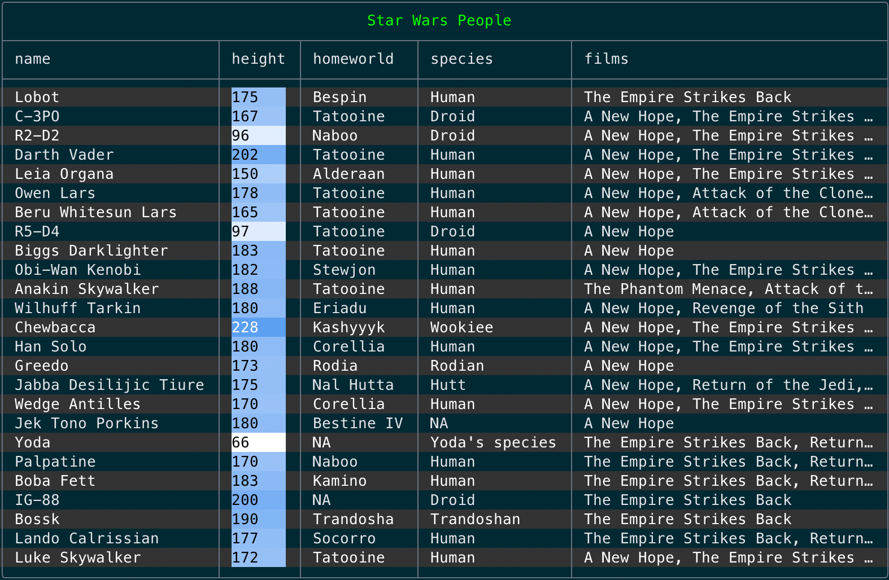
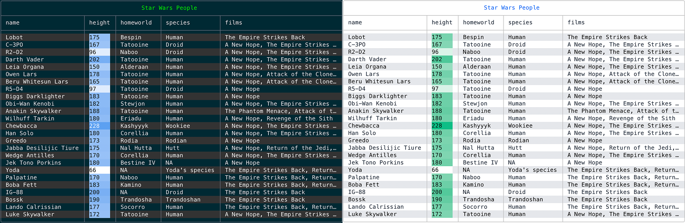
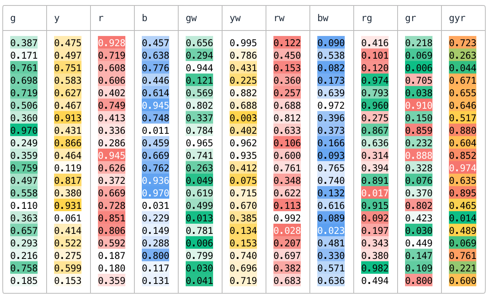
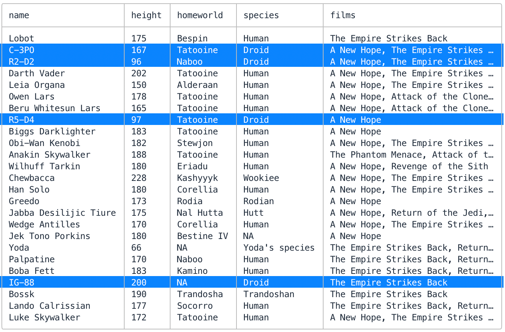
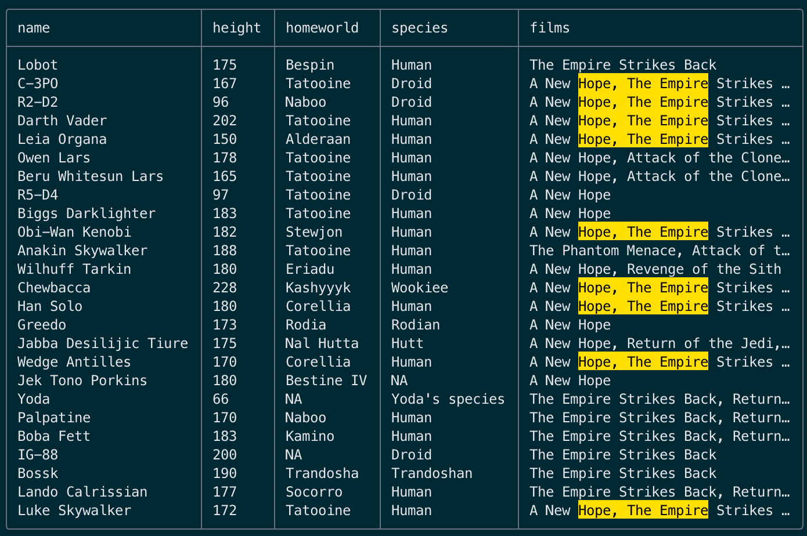
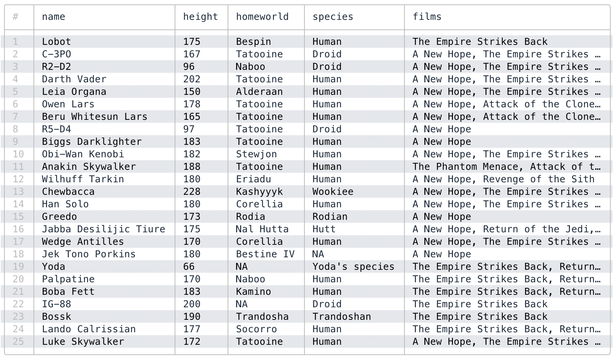

# TableManners

TableManners is a Ruby library for printing nice looking tables in your terminal. Real handy when messing around with data in Ruby. For example:

```rb
require "table_manners"

options = { title: "Star Wars People", zebra: true, color_scale: :height }
puts TableManners.new(Starwars.all, options)
```

Prints this lovely table in your terminal:



### Installation

```ruby
# install gem
$ gem install table_manners

# or add to your Gemfile
gem "table_manners"
```

### Important Features

- auto-themes to pick light or dark based on your terminal background
- auto-layout to fit your terminal window
- auto-format floats and dates
- auto-color numeric columns (with `color_scales:` option)
- titles, row numbers, titles, zebra stripes...

### Themes

TableManners examines the background color of your terminal to pick either the dark or light theme. You can also specify `:dark` or `:light` manually, or even an `:ansi` theme to use your terminal's default colors. This feature is [surprisngly complicated](https://github.com/gurgeous/table_manners/blob/main/lib/table_manners/util/termbg.rb).



### Rows (Your Data)

Construct your table with an array of rows. Rows are hashes, ActiveRecord objects, structs, Data records, or anything that responds to `to_h`. It also supports some oddball things like arrays (as rows) or even a single hash, similar to AmazingPrint.

```ruby
puts TableManners.new([{a: "hello", b: "world"}, {a: "foo", b: "bar"})
puts TableManners.new(Recipe.all.to_a)  # activerecord
puts TableManners.new(array_of_structs) # these use to_h
puts TableManners.new([[1,2],[3,4]]])   # array of arrays
puts TableManners.new(authors[0])       # single hash
```

### Big List of Options

Here is a more complex example to get you started:

```ruby
options = {
  color_scales: { commission: :g },
  columns: %i[ name commission bday phone ],
  mark: -> { _1[:name] =~ /jane|john/i },
  row_numbers: true,
  save: "/tmp/people.csv",
  search: "february",
  title: "Employees",
  zebra: true,
}
puts TableManners.new(rows, options)
```

| option | default | details |
| ------ | ------- | ------- |
| `color_scales` | ─ | Color code a column of floats, see screenshots below. Similar to the "conditional formatting" feature in Google Sheets. Can be a column name, an array of column names, or a hash from column names to colors. |
| `color` | `nil` | Should we use color? Specify `true` or `false`, or leave it as nil to autodetect. Autodetect will turn on color unless redirecting to a file. When using autodetect, you can force it on by setting `ENV["FORCE_COLOR"]`, or off with `ENV["NO_COLOR"]`. |
| `columns` | `nil` | Manually set which columns to include. Leave unset to show all columns.
| `digits` | `3` | Format floats to this number of digits. TableManners will look for either `Float` cells or string floats. |
| `layout` | `true` | This controls column widths. Leave unset or use `true` for autolayout. Autolayout will shrink the table to fit inside the terminal. `false` turns off layout and columns will be full width. Use an int to fix all columns to a certain width, or a hash to just set a few. |
| `mark` | ─ | `mark` is a way to highlight specific columns. For example, use `mark: ->(row) { row[:planet] == "tatooine" }` to highlight those rows. Your lambda can also return a specific color if you want.
| `placeholder` | `"—"` | Put this into empty cells. |
| `row_numbers` | `false` | Show row numbers in the table. |
| `save` | ─ | If you set this to a file path, TableManners will save your table as a CSV file too. Useful if you want to do something else with the data. |
| `search` | ─ | string/regex to highlight in output |
| `strftime` | `"%Y-%m-%d"` | string for formatting dates |
| `theme` | `:dark` | Which theme to use, one of `:dark`, `:light` or `:ansi`. |
| `title` | ─ | Add a title line to the table. |
| `zebra` | `false` | Turn on zebra stripes. |

### Tips

**Color scales** are useful for visualizing numeric columns. Here is the full list of supported scales:



---

Use **mark** to highlight certain rows. Maybe you need to find the droids? Or **search** to highlight text. I almost always use **row numbers** and **zebra stripes** too.

```ruby
puts TableManners.new(rows, mark: -> { _1[:homeworld] =~ /droids/i })
puts TableManners.new(rows, search: /hope.*empire/i })
puts TableManners.new(..., row_numbers: true, zebra: true)
```





### Ways to Output

There are a few different ways to render the table:

```ruby
puts TableManners.new(...)        # 1 - build one giant string
TableManners.new(...).render      # 2 - write to $stdout row by row
TableManners.new(...).render(io)  # 3 - write to io row by row
```

1. Uses `to_s`, so there will be a pause before output shows up. Annoying for large tables.
1. Write to `$stdout` one row at a time. I try to use this for tables over 10,000 rows.
1. Render to any I/O stream ($stdout/$stderr, an open file, StringIO...)

### Similar Tools

We love CSV tools and use them all the time! Here are a few that we rely on:

- [bat](https://github.com/sharkdp/bat) - syntax highlights csv files, and many others
- [csvlens](https://github.com/YS-L/csvlens) & [tidy viewer](https://github.com/alexhallam/tv) - great viewers for CSV files, beautiful and fun
- [qsv](https://github.com/dathere/qsv) - filter, sort, combine, join... (a fork of [xsv](https://github.com/BurntSushi/xsv))
- [Terminal::Table](https://github.com/tj/terminal-table) - wonderful rubygem for pretty printing tables, great for non-hash data too
- [visidata](https://www.visidata.org) - the best for poking around large files, it does everything
